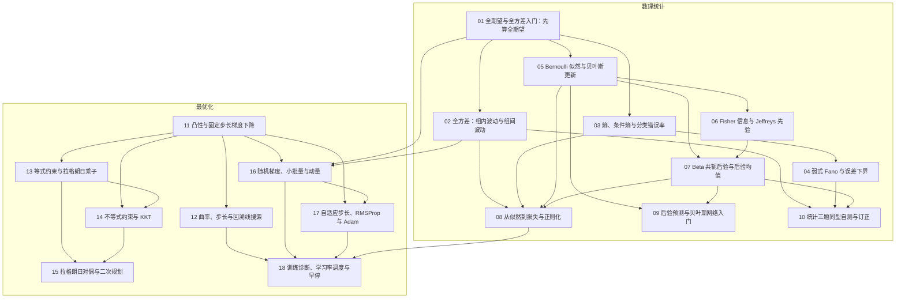

# 知识图谱 · 数理统计与最优化

第 10 课用期中三题自测收束数理统计，第 11 课开始最优化。箭头表示知识依赖，第 16 课的随机梯度会用到前面学过的条件期望。各概念的前置见[登记表](../01_学习计划/概念登记表.md)。

```mermaid
flowchart TD
  subgraph stats["数理统计"]
    L01["01 全期望与全方差入门：先算全期望"]
    L02["02 全方差：组内波动与组间波动"]
    L03["03 熵、条件熵与分类错误率"]
    L04["04 弱式 Fano 与误差下界"]
    L05["05 Bernoulli 似然与贝叶斯更新"]
    L06["06 Fisher 信息与 Jeffreys 先验"]
    L07["07 Beta 共轭后验与后验均值"]
    L08["08 从似然到损失与正则化"]
    L09["09 后验预测与贝叶斯网络入门"]
    L10["10 统计三题同型自测与订正"]
  end
  subgraph optim["最优化"]
    L11["11 凸性与固定步长梯度下降"]
    L12["12 曲率、步长与回溯线搜索"]
    L13["13 等式约束与拉格朗日乘子"]
    L14["14 不等式约束与 KKT"]
    L15["15 拉格朗日对偶与二次规划"]
    L16["16 随机梯度、小批量与动量"]
    L17["17 自适应步长、RMSProp 与 Adam"]
    L18["18 训练诊断、学习率调度与早停"]
  end
  L01 --> L02
  L01 --> L03
  L03 --> L04
  L01 --> L05
  L05 --> L06
  L05 --> L07
  L06 --> L07
  L02 --> L08
  L03 --> L08
  L05 --> L08
  L07 --> L08
  L05 --> L09
  L07 --> L09
  L02 --> L10
  L04 --> L10
  L07 --> L10
  L11 --> L12
  L11 --> L13
  L11 --> L14
  L13 --> L14
  L13 --> L15
  L14 --> L15
  L01 --> L16
  L02 --> L16
  L11 --> L16
  L11 --> L17
  L16 --> L17
  L12 --> L18
  L16 --> L18
  L17 --> L18
  L08 --> L18
```
